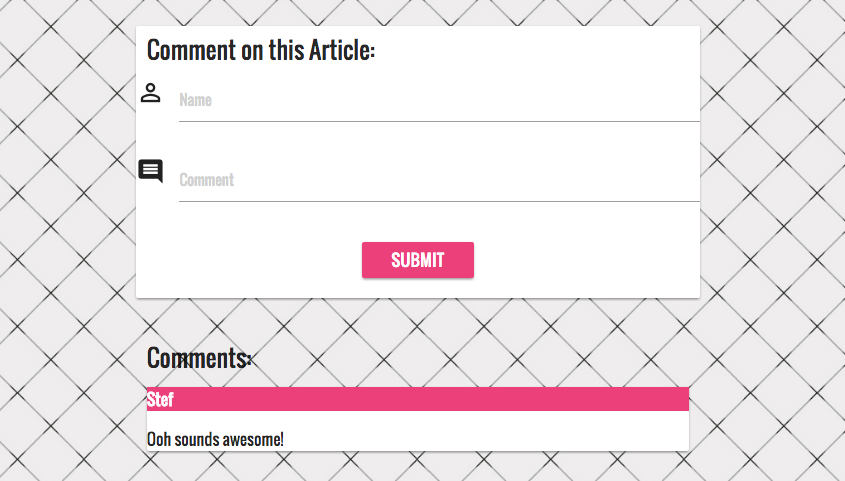

# scraping-the-news

Uses Cheerio to scrape news articles from a site and allows the user to make comments and delete them. Uses Mongoose to store comments and articles.

## Getting Started
https://scrape-the-news.herokuapp.com/

## Screen Shots

Scraped news articles from The Verge

Article page to read each article

Add comments by filling in the form